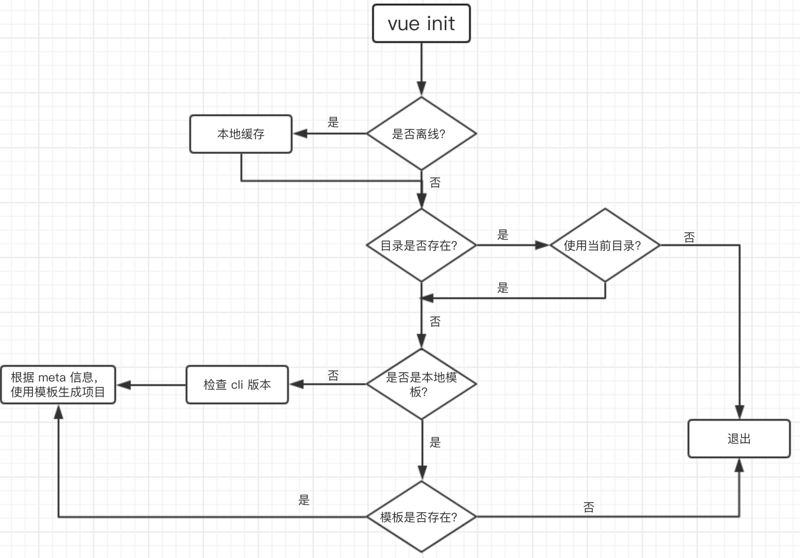

# 如何去创建vue-cli的自定义模板

## 生成vue-cli自定义模板的必要条件

1. vue-cli的模板必须符合以下规则：
    1. 必须有`template`目录
    2. 必须具有`meta.{js/json}`文件
2. `template`目录下，必须包含模板的所有内容，以便后续根据用户行为的修改与删除
3. `meta.{js|json}`文件的创建，具体看**meta.md**

## vue-cli的那些事

在没有缓存的情况下，vue-cli会通过[download-git-repo工具](https://github.com/flipxfx/download-git-repo)去`github/gitlab/bitbucket`上面`clone`指定的项目，然后根据`meta.{js|json}`，注册`handlebars`的辅助函数。到这里，模板生成前的工作都已经做完，这时候开始调用`generate`函数，生成基于用户行为的模板了。`generate`函数首先会获取`meta`的信息，利用[metalsmith工具](https://github.com/segmentio/metalsmith)读取`template`内容。之后，就进入用户问答的环节，通过`prompts`中模板预设的几个问题，来获取用户行为，删除不必要的文件，以及过滤文件中的部分内容，以生成基于用户行为的模板。最后，在模板完成之后，会有一个后置函数，完成用户基于当前模板的操作及消息提示。

## **深入学习，请参考**：

- [从vue-cli源码学习如何写模板](https://github.com/dwqs/blog/issues/56)
- [vue-cli](https://github.com/vuejs/vue-cli)